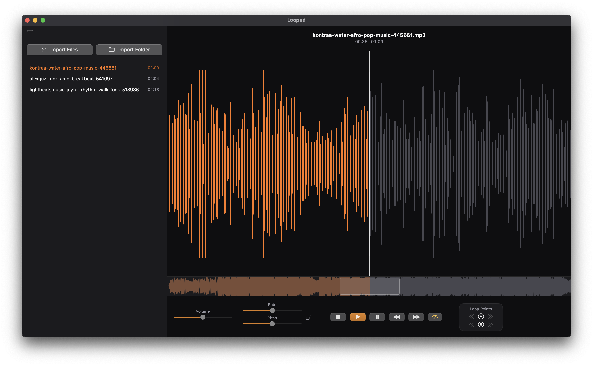

# looped

A feature rich macOS SwiftUI audio-looping app for rehearsing musicians. 
load a track (WAV/MP3/AIFF), scrub an interactive waveform, set A/B loop points, 
and play back with adjustable speed, pitch and volume.



## Features

- Setting Loop Points, nudge loop points, overwrite single Loop Points on the fly
- Scrubbing natively with the momentum of the touchpad, dragging with the mouse or clicking in the minimap
- Rate/Pitch controls with optional syncing to prevent artifacts
- Library with drag & drop support
- Quality of Life features (space for start/pause, a & b to set the loop points, right click to reset controls or toggle loop points)

## Install (users)

Download `Looped-<version>.zip` from the [latest release](https://github.com/rkkeepstrack/looped/releases/latest)
(also linked from the [website](https://rkkeepstrack.github.io/looped/)), or use Homebrew:

```bash
brew tap rkkeepstrack/looped https://github.com/rkkeepstrack/looped.git
brew install --cask --no-quarantine looped
```

The app is not notarized (no Apple Developer account), so macOS quarantines a plain
download: `--no-quarantine` avoids that.

## Prerequisites

- **macOS 15+** with the **Command Line Tools** (`xcode-select --install`). That's the only
  toolchain needed — build, run, *and* test all work without full Xcode (tests use Swift
  Testing, not XCTest). Full Xcode works too if you have it.
- [Homebrew](https://brew.sh), then install the dev tools:

  ```bash
  brew bundle          # installs just + swiftformat (see Brewfile)
  ```

## Run

The application uses just to run commands.

```bash
just run               # build a .app bundle and launch it
```

## Develop

```bash
just                   # list all recipes
just build             # build (debug)
just test              # run the unit tests — headless, no Xcode
just format            # reformat with SwiftFormat
```

## Motivation

This repository started out as a Tool that I really needed to rehearse drums more easily, and to learn a new language. The project stagnated for a long time because I had nowhere to rehearse, but this changed now. I decided to finish the project and implement many new features: but Swift and XCode is nothing that really grinds my gears any longer. 

That's why most of the new Code is written by Claude Code, and I only reviewed the Code from a high-level and gave architecture instructions from a PO perspective. The result is a software that I want to use and maybe many of you also want to use (or adapt). 

## License

Looped is free for personal and other noncommercial use under the
[PolyForm Noncommercial License 1.0.0](LICENSE.md) — use it, modify it,
share it, just not commercially. 

Built with [DSWaveformImage](https://github.com/dmrschmidt/DSWaveformImage) (MIT).
